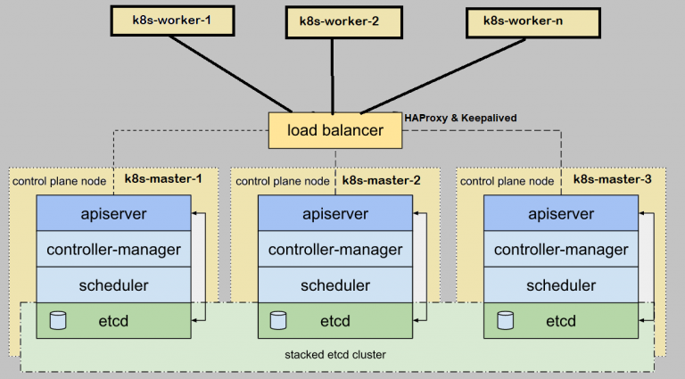

# 部署高可用kubernetes集群

视频教程：
https://www.bilibili.com/video/bv15z4y1r7Kw

## 准备开始

- 配置三台机器 kubeadm 的最低要求 给主节点
- 配置三台机器 kubeadm 的最低要求 给工作节点
- 在集群中，所有计算机之间的完全网络连接（公网或私网）
- 所有机器上的 sudo 权限
- 每台设备对系统中所有节点的 SSH 访问
- 在所有机器上安装 kubeadm 和 kubelet，kubectl 是可选的。



## 安装前准备
1、准备4台，2G或更大内存，2核或以上CPU，30G以上硬盘 物理机或云主机或虚拟机
2、系统centos 7.x


## 环境准备

```shell

#在本地执行,把我本机的密匙批量发送到所有主机上，就可以实现免密登录
bash ./local_copy_ssh_to_host.sh

#根据规划设置主机名(在4台机上分别运行)
hostnamectl set-hostname master01
hostnamectl set-hostname master02
hostnamectl set-hostname master03
hostnamectl set-hostname worker01

#在所有机器上执行
cat >> /etc/hosts << EOF
192.168.0.199 k8svip
192.168.0.200 master01
192.168.0.201 master02
192.168.0.202 master03
192.168.0.210 worker01
EOF

#设置免登录
ssh-keygen -t rsa -P '' -f ~/.ssh/id_rsa &> /dev/null
ssh-copy-id root@master01
ssh-copy-id root@master02
ssh-copy-id root@master03
ssh-copy-id root@worker01


#关闭防火墙(在3台机运行)
systemctl stop firewalld && systemctl disable firewalld

#关闭selinux(在3台机运行)
sed -i 's/enforcing/disabled/' /etc/selinux/config && setenforce 0

#关闭swap(在3台机运行)
swapoff -a && sed -ri 's/.*swap.*/#&/' /etc/fstab


#时间同步(在3台机运行)
yum install ntpdate -y && ntpdate time.windows.com

```

## 安装Docker
```shell
# step 1: 安装必要的一些系统工具
sudo yum install -y yum-utils device-mapper-persistent-data lvm2
# Step 2: 添加软件源信息
sudo yum-config-manager --add-repo https://mirrors.aliyun.com/docker-ce/linux/centos/docker-ce.repo
# Step 3: 更新并安装Docker-CE
sudo yum makecache fast
sudo yum -y install docker-ce-20.10.0
# Step 4: 开启Docker服务
sudo systemctl start docker && systemctl enable docker

# 注意：
# 官方软件源默认启用了最新的软件，您可以通过编辑软件源的方式获取各个版本的软件包。例如官方并没有将测试版本的软件源置为可用，您可以通过以下方式开启。同理可以开启各种测试版本等。
# vim /etc/yum.repos.d/docker-ee.repo
#   将[docker-ce-test]下方的enabled=0修改为enabled=1
#
# 安装指定版本的Docker-CE:
# Step 1: 查找Docker-CE的版本:
# yum list docker-ce.x86_64 --showduplicates | sort -r
#   Loading mirror speeds from cached hostfile
#   Loaded plugins: branch, fastestmirror, langpacks
#   docker-ce.x86_64            17.03.1.ce-1.el7.centos            docker-ce-stable
#   docker-ce.x86_64            17.03.1.ce-1.el7.centos            @docker-ce-stable
#   docker-ce.x86_64            17.03.0.ce-1.el7.centos            docker-ce-stable
#   Available Packages
# Step2: 安装指定版本的Docker-CE: (VERSION例如上面的17.03.0.ce.1-1.el7.centos)
# sudo yum -y install docker-ce-[VERSION]

# docker镜像加速，"https://s2q9fn53.mirror.aliyuncs.com"这个地址建议自己登陆阿里云，在容器镜像服务中找到。
# 可以通过修改daemon配置文件/etc/docker/daemon.json来使用加速器
sudo mkdir -p /etc/docker
sudo tee /etc/docker/daemon.json <<-'EOF'
{
  "registry-mirrors": ["https://s2q9fn53.mirror.aliyuncs.com"]
}
EOF
sudo systemctl daemon-reload && sudo systemctl restart docker
```

## 安装kubelet、kubeadm、kubectl

- kubeadm：用来初始化集群的指令。
- kubelet：在集群中的每个节点上用来启动 pod 和容器等。
- kubectl：用来与集群通信的命令行工具。

kubeadm 不能 帮您安装或者管理 kubelet 或 kubectl，所以您需要确保它们与通过 kubeadm 安装的控制平面的版本相匹配。 如果不这样做，则存在发生版本偏差的风险，可能会导致一些预料之外的错误和问题。 然而，控制平面与 kubelet 间的相差一个次要版本不一致是支持的，但 kubelet 的版本不可以超过 API 服务器的版本。 例如，1.7.0 版本的 kubelet 可以完全兼容 1.8.0 版本的 API 服务器，反之则不可以。

```shell
#添加kubernetes阿里YUM源
cat <<EOF > /etc/yum.repos.d/kubernetes.repo
[kubernetes]
name=Kubernetes
baseurl=https://mirrors.aliyun.com/kubernetes/yum/repos/kubernetes-el7-x86_64/
enabled=1
gpgcheck=1
repo_gpgcheck=1
gpgkey=https://mirrors.aliyun.com/kubernetes/yum/doc/yum-key.gpg https://mirrors.aliyun.com/kubernetes/yum/doc/rpm-package-key.gpg
EOF

yum install -y kubelet-1.19.4 kubeadm-1.19.4 kubectl-1.19.4 && systemctl enable kubelet && systemctl start kubelet

```

## 部署Kubernetes Master
在192.168.0.200（Master）执行
```shell

#注意，kubeadm init 前,先准备k8s运行所需的容器
#可查询到kubernetes所需镜像
kubeadm config images list

#写了个sh脚本，把所需的镜像拉下来
cat >> alik8simages.sh << EOF
#!/bin/bash
list='kube-apiserver:v1.19.5
kube-controller-manager:v1.19.5
kube-scheduler:v1.19.5
kube-proxy:v1.19.5
pause:3.2
etcd:3.4.13-0
coredns:1.7.0'
for item in \$list
  do

    docker pull registry.aliyuncs.com/google_containers/\$item && docker tag registry.aliyuncs.com/google_containers/\$item k8s.gcr.io/\$item && docker rmi registry.aliyuncs.com/google_containers/\$item

  done
EOF
#运行脚本下载
bash alik8simages.sh

```


# keepalived + haproxy 搭建高用集群
```shell
#https://github.com/kubernetes/kubeadm/blob/master/docs/ha-considerations.md#options-for-software-load-balancing
#master 上执行
yum install haproxy keepalived -y
mv /etc/keepalived/keepalived.conf /etc/keepalived/keepalived.conf.bak
mv /etc/haproxy/haproxy.cfg /etc/haproxy/haproxy.cfg.bak

#从本地复制到master主机
scp ./etc/haproxy/haproxy.cfg root@192.168.0.200:/etc/haproxy/haproxy.cfg
scp ./etc/keepalived/check_apiserver.sh root@192.168.0.200:/etc/keepalived/check_apiserver.sh
scp ./etc/keepalived/keepalived.conf root@192.168.0.200:/etc/keepalived/keepalived.conf

scp ./etc/haproxy/haproxy.cfg root@192.168.0.201:/etc/haproxy/haproxy.cfg
scp ./etc/keepalived/check_apiserver.sh root@192.168.0.201:/etc/keepalived/check_apiserver.sh
scp ./etc/keepalived/keepalived.conf root@192.168.0.201:/etc/keepalived/keepalived.conf

scp ./etc/haproxy/haproxy.cfg root@192.168.0.202:/etc/haproxy/haproxy.cfg
scp ./etc/keepalived/check_apiserver.sh root@192.168.0.202:/etc/keepalived/check_apiserver.sh
scp ./etc/keepalived/keepalived.conf root@192.168.0.202:/etc/keepalived/keepalived.conf

#master 上执行
systemctl enable keepalived --now
systemctl enable haproxy --now

```


```bash
#初始化k8s集群
kubeadm init \
--control-plane-endpoint k8svip:8443 \
--kubernetes-version=v1.19.4 \
--service-cidr=10.96.0.0/12 \
--pod-network-cidr=10.244.0.0/16 \
--upload-certs

#提示initialized successfully!表示初始化成功
#To start using your cluster, you need to run the following as a regular user:

  mkdir -p $HOME/.kube
  sudo cp -i /etc/kubernetes/admin.conf $HOME/.kube/config
  sudo chown $(id -u):$(id -g) $HOME/.kube/config

# You should now deploy a pod network to the cluster.
# Run "kubectl apply -f [podnetwork].yaml" with one of the options listed at:
#   https://kubernetes.io/docs/concepts/cluster-administration/addons/

# You can now join any number of the control-plane node running the following command on each as root:
#复制你屏幕上显示的
  kubeadm join k8svip:8443 --token s8nl1g.samn73s2wzmpvl1x \
    --discovery-token-ca-cert-hash sha256:xxxxxxxxxxxxxxxxxxxxxxxxxxxxxxxxxxxxxxxxxxxxxxxxxxxxxxxxxxx \
    --control-plane --certificate-key xxxxxxxxxxxxxxxxxxxxxxxxxxxxxxxxxxxxxxxxxxxxxxxxxxxxxxxxxxxxxx

# Please note that the certificate-key gives access to cluster sensitive data, keep it secret!
# As a safeguard, uploaded-certs will be deleted in two hours; If necessary, you can use
# "kubeadm init phase upload-certs --upload-certs" to reload certs afterward.

# Then you can join any number of worker nodes by running the following on each as root:
#复制你屏幕上显示的
kubeadm join k8svip:8443 --token s8nl1g.samn73s2wzmpvl1x \
    --discovery-token-ca-cert-hash sha256:xxxxxxxxxxxxxxxxxxxxxxxxxxxxxxxxxxxxxx
```
#### 部署CNI网络插件

```shell

#下载flannel网络插件
docker pull quay.io/coreos/flannel:v0.13.1-rc1

kubectl apply -f kube-flannel.yml
```
